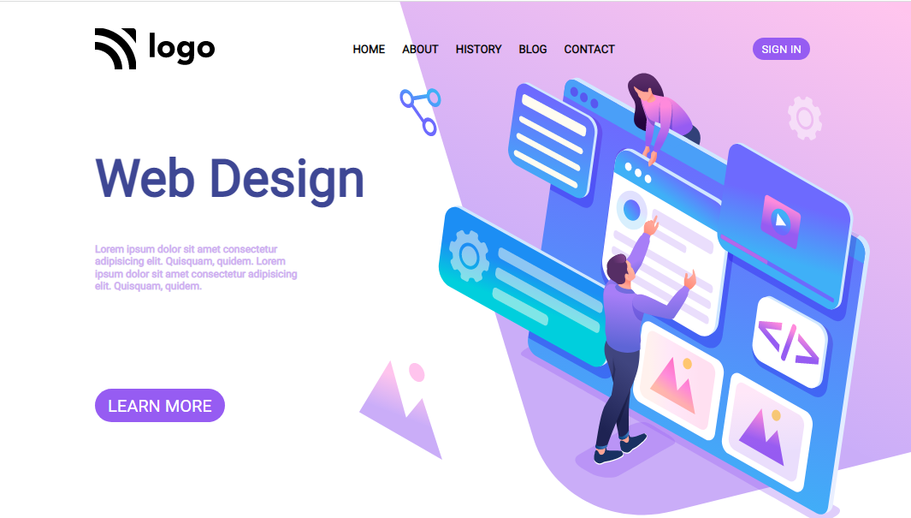

# Design Agency Landing Page
**Hi everyone, I am Raushan**

> This project is a landing page of a Design Agency website built purely in HTML and CSS😎.

- This project used concepts of `flexbox`, `positions`, `background` and `svg manipulation` heavily😁. Especially I got to learn about scaling the size of `svg` images keeping the aspect ratio intact😎. Multiple svg images use in the same project reinstated the confidence of handling tricky projects using just pure CSS💪.

- The project being a completely new experience for me took around 3.5 hours to complete and while finishing the project up I got to learn many new things😃.

Below is the link and view of the project👇👇👇
 
[DesignVerse](designverse.netlify.app)

